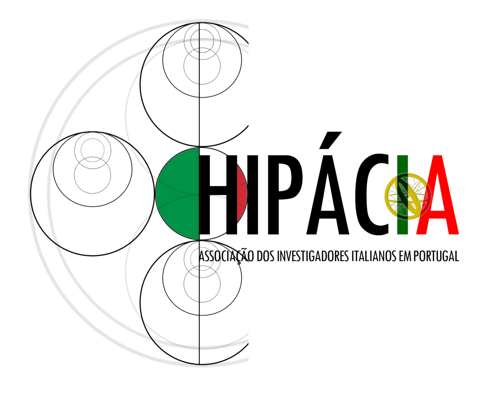
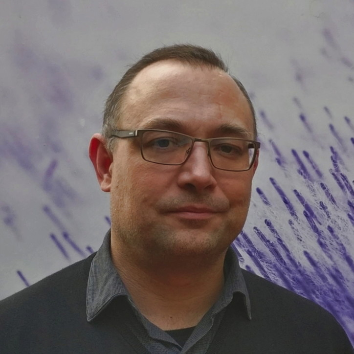
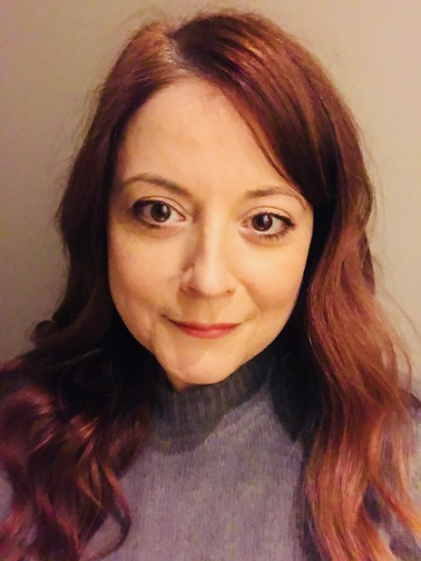
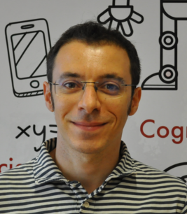
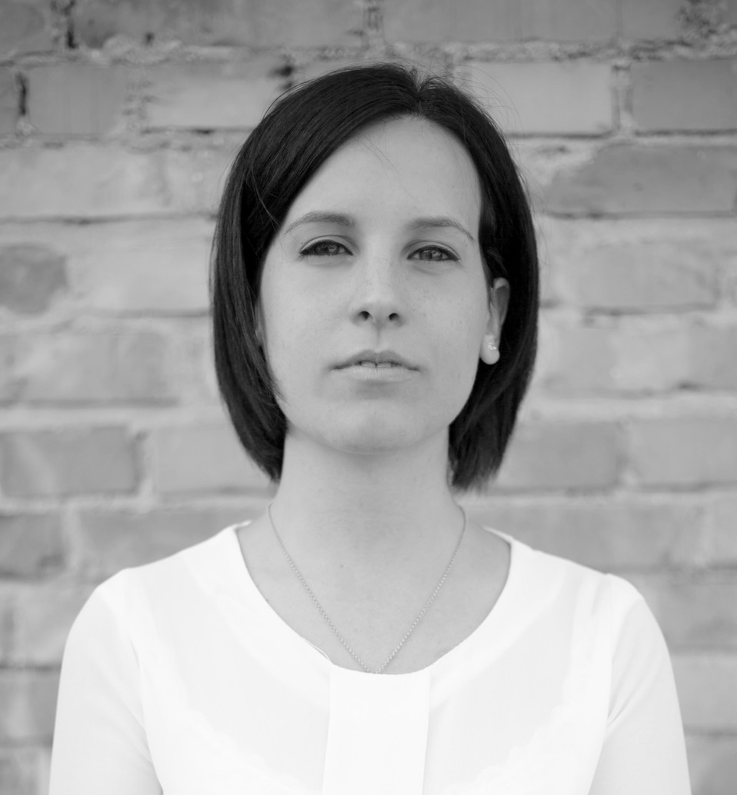

Hipácia è l'associazione di ricercatori italiani in Portogallo.

Gli scopi principali di Hipácia sono:
* creare una rete di connessione tra ricercatori italiani e portoghesi in Portogallo,
* aiutare i ricercatori italiani nell'integrazione nel tessuto accademico (con mentoring e sponsorship),
* favorire le collaborazioni tra istituti e associazioni in ambito nazionale e internazionale,
* organizzare eventi divulgativi che possano avvicinare le persone che non hanno un profilo accademico alla scienza.

Direzione:

Davide Accardi, presidente

Andrea Zille, vicepresidente

Maria Alessandra Bilotta, membro della direzione (vogal)

Mónica Di Berardino, segretaria della direzione

Assemblea dei soci:

Giovanni Saponaro, presidente dell'assemblea

Tesoriere:

Davide Masoero

Altri:

Francesca Dal Cin
